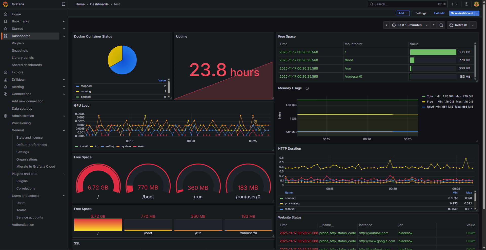

# Grafana-Prometheus
# Linux Monitoring Dashboard (Grafana + Prometheus)

This project contains a monitoring dashboard created using Grafana and Prometheus.

## Features
- Docker container status
- Filesystem usage (/, /boot, /run)
- GPU load visualization
- HTTP probe status (Blackbox exporter)
- Memory usage and uptime metrics
- Multiple panel types: gauge, stat, time series, pie chart

## Preview

## Dashboard JSON
The JSON file is included so it can be imported directly:
- `dashboard.json`

## Technologies
- Grafana 
- Prometheus 
- Node exporter / Blackbox exporter
- Linux system metrics monitoring

## How to import
1. Grafana → Dashboards → Import
2. Upload `dashboard.json`
3. Select Prometheus datasource
